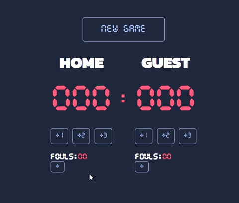

# Basketball-scoreboard
JavaScript challenge from Scrimba

HTML, CSS and JS done from scratch following pre-designed UI from Figma as a reference for CSS. 

Room for improvement: Refactor the JS code as the functions are repetative. 

Next challange will be to add the timer, period and to hihglight the leader. 

